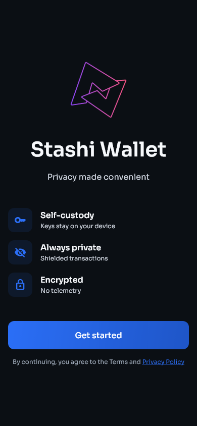
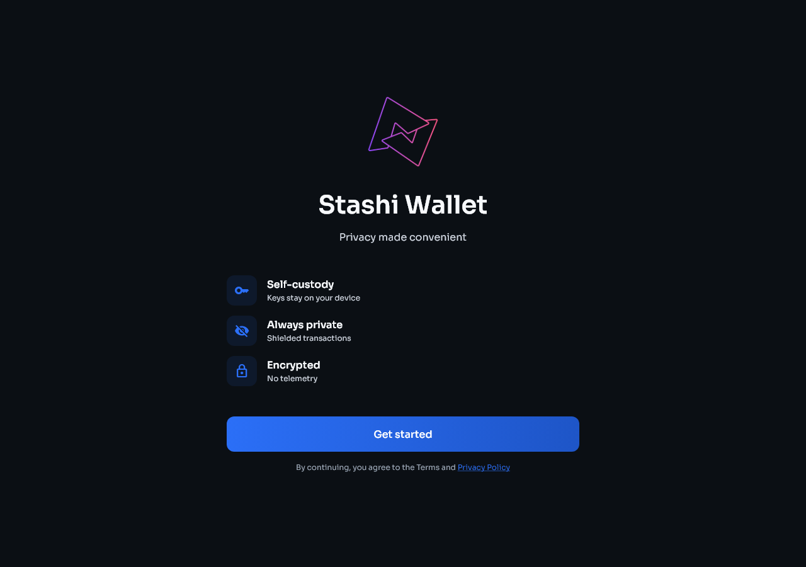

# Stashi Wallet user guide

This guide covers setup, everyday use, recovery, privacy settings, key management, build verification, and troubleshooting.

If you are moving from Treasure Chest or Pirate Wallet Lite, start with [Moving from another Pirate Chain wallet](migration.md).

## Contents

1. [Install and set up the wallet](getting-started.md)
2. [Home, Wallets, Activity, and Settings](wallet-basics.md)
3. [Receive and send ARRR](send-receive.md)
4. [Seed accounts, keys, and addresses](keys-and-accounts.md)
5. [Move from Treasure Chest or Pirate Wallet Lite](migration.md)
6. [Network privacy and synchronization](network-and-sync.md)
7. [Backups and wallet security](security-and-backups.md)
8. [Settings and build verification](settings-and-verification.md)
9. [Troubleshooting](troubleshooting.md)
10. [Advanced use](advanced.md)

## Phone and desktop layouts

The same controls are available on phone and desktop. On a phone, cards and actions are stacked and some pages need to be scrolled. On a wide desktop window, related panels may appear side by side.

| Phone | Desktop |
|---|---|
|  |  |

## Getting help

Before asking for help, read [Troubleshooting](troubleshooting.md). It explains what information is safe to share and how to create a useful debug log. Never send recovery words or private keys to support staff.
