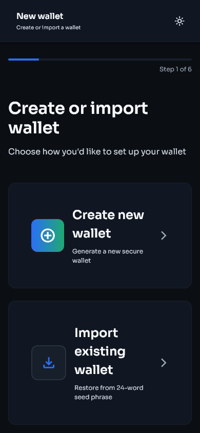
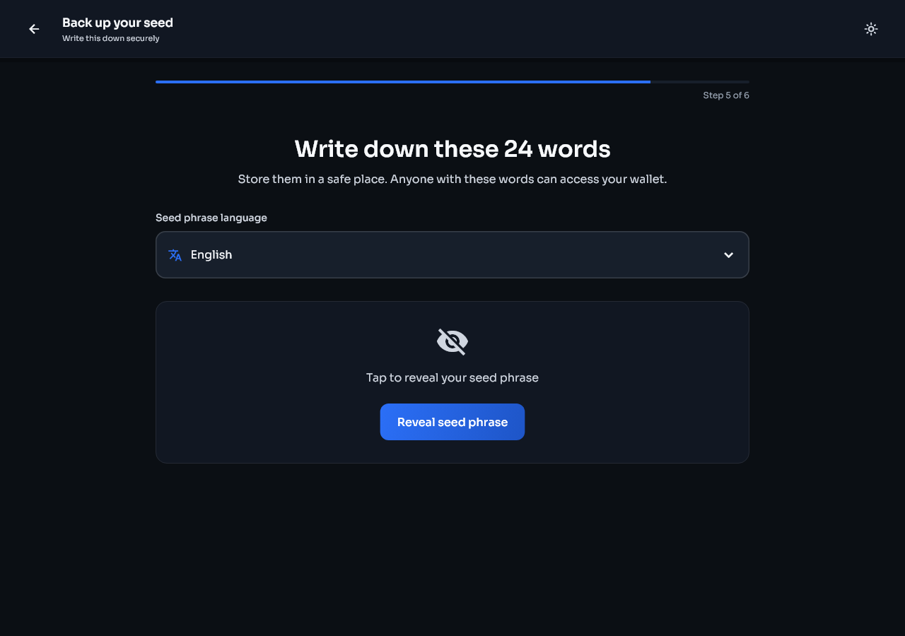
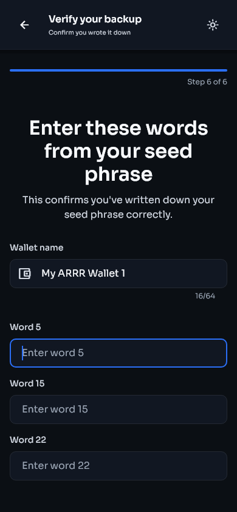
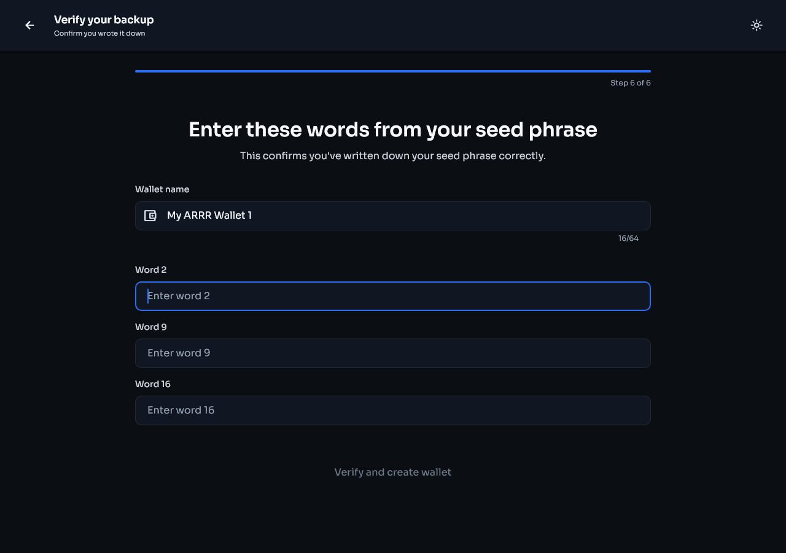
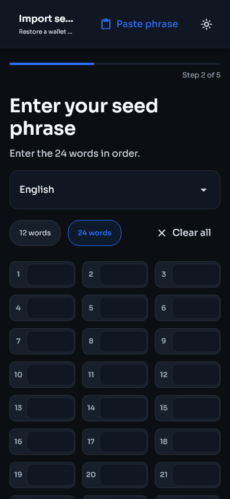

# Install and set up Stashi Wallet

[Guide contents](README.md) | [Next: Wallet basics](wallet-basics.md)

## Download the right file

Use the official PirateNetwork GitHub release page. Do not install wallet files sent through direct messages or uploaded to file-sharing sites.

Choose the package for your device:

- Windows: download `Stashi-Wallet-windows-installer.exe`.
- macOS: download `Stashi-Wallet-macos.dmg`. It supports Apple Silicon and Intel Macs.
- Linux:
  - Download `Stashi-Wallet-linux-x86_64.AppImage` when you want a portable file that runs on most 64-bit Linux distributions without installation.
  - Download `Stashi-Wallet-amd64.deb` for Debian-based distributions such as Debian, Ubuntu, Linux Mint, Pop!_OS, and Zorin OS.
  - Download `Stashi-Wallet.flatpak` when your distribution supports Flatpak or you normally install applications through Flatpak. This includes distributions such as Fedora, Endless OS, and many others after Flatpak is enabled.
- Android: use `Stashi-Wallet-android-V8.apk` on current 64-bit ARM phones and tablets. Use `Stashi-Wallet-android-V7.apk` only on an older 32-bit ARM device that cannot install the V8 build.
- iOS: Stashi Wallet is not yet distributed for iPhone or iPad. Until an iOS version is available, use a third-party wallet with Pirate Chain support, such as Edge.

The release includes SHA-256 checksums and PGP signatures. See [Verify the downloaded release files](settings-and-verification.md#verify-the-downloaded-release-files) if you want to check them before installation.

## Open the wallet

1. Install or open Stashi Wallet.
2. Confirm that the name and icon match the official release.
3. On the welcome screen, select **Get started**.
4. Choose **Create new wallet**, **Import existing wallet**, or **View only**.

| Phone | Desktop |
|---|---|
|  |  |

| Setup choices on a phone | Setup choices on desktop |
|---|---|
|  |  |

## Create a new wallet

1. Select **Create new wallet**.
2. Create an app passphrase. Use a passphrase that is not used for another account.
3. Enable device biometrics if you want faster unlocking. Biometrics do not replace the recovery phrase.
4. Read the backup warning.
5. Write the 24 recovery words on paper or another offline medium, in the exact order shown.
6. Review the suggested wallet name. New wallets start with **My ARRR Wallet 1** and continue with the next number. You can edit the name before creation.
7. Confirm the requested words.
8. Store the backup somewhere protected from theft, fire, and water.
9. Wait for synchronization to finish before relying on the displayed balance.

| Phone | Desktop |
|---|---|
|  |  |

The phrase language control appears above the recovery words. Leave it on the language you intend to use for this backup.

| Phone | Desktop |
|---|---|
|  |  |

The final confirmation page lets you name the wallet before it is created.

| Phone | Desktop |
|---|---|
|  |  |

Do not photograph the phrase, paste it into a cloud note, email it, or enter it into a website. Anyone with those words can spend the wallet's funds.

## Restore a recovery phrase

1. Select **Import existing wallet**.
2. Enter all 24 words in order. Check spelling and language if the phrase is rejected.
3. Create the local app passphrase and choose whether to enable biometrics.
4. Review or change the suggested local wallet name.
5. Choose the wallet birthday. Use a block height from before the wallet first received funds. An earlier height is safe but takes longer to scan.
6. Finish setup and let the scan complete.
7. Check the balance and Activity page.
8. If the old wallet used additional ZIP-32 seed accounts, follow [Find funds in higher seed accounts](migration.md#find-funds-in-higher-seed-accounts).

| Phone | Desktop |
|---|---|
|  |  |

| Wallet name and birthday on a phone | Wallet name and birthday on desktop |
|---|---|
|  |  |

Restoring the phrase does not automatically restore separately imported private keys. Those keys must be imported again under **Settings > Keys & addresses**.

## Create a view-only wallet

A view-only wallet can monitor supported shielded activity but cannot spend it.

1. Select **View only**.
2. Enter the Sapling viewing key.
3. Enter a birthday height from before the first transaction for that key.
4. Finish setup and wait for the scan.

Keep a viewing key private. It cannot spend funds, but it can reveal transaction information associated with that key.

## After setup

Confirm these items before receiving a payment:

- The wallet opens with the passphrase or biometric method you expect.
- The recovery phrase backup has been checked twice.
- The network status shows connected and the sync reaches the current chain height.
- You can open **Receive**, generate an address, and copy it.
- The selected wallet at the top of the screen is the one you intend to use.
