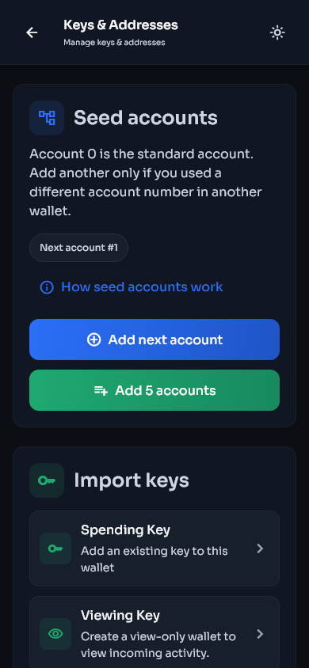
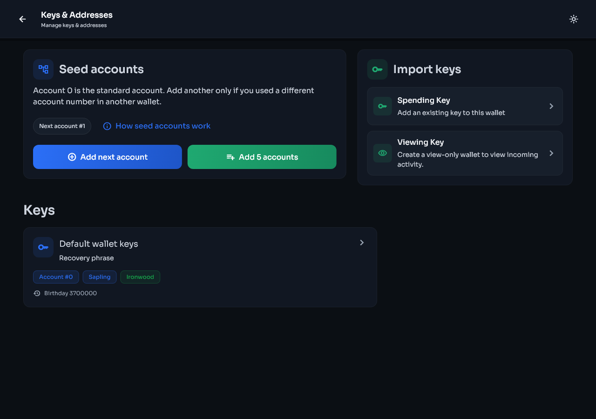
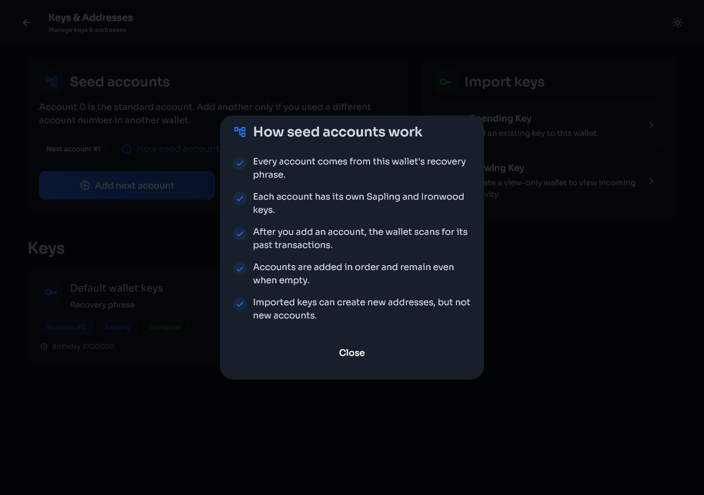

# Seed accounts, keys, and addresses

[Previous: Send and receive](send-receive.md) | [Guide contents](README.md) | [Next: Migration](migration.md)

Open **Settings > Keys & addresses** to see the key groups available to the selected wallet.

| Phone | Desktop |
|---|---|
|  |  |

## Seed accounts

A recovery phrase can derive many numbered ZIP-32 accounts. Account 0 is the standard account used by most wallets. Accounts 1, 2, and higher are separate account key groups derived from the same phrase.

Each seed account added by Stashi Wallet includes its supported Sapling and Ironwood key material. The account number is not a diversified-address number.

Use these controls only when you know or suspect that another wallet used a higher account number:

- **Add next account** adds the next consecutive seed account and starts the required scan.
- **Add 5 accounts** adds the next five consecutive seed accounts and starts the required scan.

The controls never skip an account number. Wait for the current account scan to finish before adding another batch.

Select **How seed accounts work** for the same explanation inside the wallet.

| Phone | Desktop |
|---|---|
|  |  |

### When to add seed accounts

Add accounts when:

- You restored a phrase from another wallet and some history is missing.
- The old wallet let you create more than one account under the same phrase.
- You know that a payment was sent to a higher numbered account.

Do not add large numbers without a reason. Each added key group gives the scanner more keys to test and can increase scanning work.

## Imported spending keys

An imported spending key controls one key scope. It can spend the notes it owns and can generate supported diversified addresses for that key. It cannot derive sibling seed accounts because it does not contain the parent recovery phrase.

To import one:

1. Open **Settings > Keys & addresses**.
2. Select **Spending Key** under Import keys.
3. Enter the key.
4. Enter a birthday height from before its first transaction.
5. Confirm the import.
6. Let the automatic rescan finish.
7. Open the imported key and check its balance and addresses.

| Phone | Desktop |
|---|---|
|  |  |

The seed account buttons do not apply to imported spending keys. That is intentional.

## Imported viewing keys

A viewing key can detect supported incoming activity and derive addresses within its key scope, but it cannot spend funds. It cannot derive sibling seed accounts.

To add one to an existing wallet:

1. Open **Settings > Keys & addresses**.
2. Select **Viewing Key**.
3. Enter the key and a suitable birthday height.
4. Confirm and wait for the rescan.

Use a separate view-only wallet when you want monitoring without any spending authority on that device.

## Sapling and Ironwood labels

The labels on a key card show which shielded key types that group supports. Old wallets and imported keys may support Sapling only. Seed accounts created by current Stashi Wallet builds can include both Sapling and Ironwood.

Receiving funds to one shielded pool does not make the same address valid for another pool. Use the address produced by the wallet for the selected key and payment type.

## Diversified addresses

A key can produce many payment addresses. These are addresses within the same account, not new seed accounts.

- Generating a new diversified address does not create a new recovery phrase.
- Old addresses remain able to receive funds.
- Address rotation reduces address reuse.
- Labels and color tags remain local to this installation.
- A spending or viewing key can derive addresses only within the scope represented by that key.

## Key details and export

Open a key card to view its addresses and available actions. Exporting sensitive key material requires authentication.

Before exporting:

1. Close screen-sharing and recording software.
2. Make sure no one can see the display.
3. Copy the key only to the device or offline backup that needs it.
4. Clear the destination clipboard if the operating system does not do so automatically.
5. Never send a spending key through chat or email.

## Seed account controls are not shown for imported keys

Only a wallet with its recovery phrase can derive the next seed account. Imported spending keys and viewing keys can create diversified addresses inside their own scope, but they cannot recreate account 1, account 2, or any other sibling account. This is a protocol-level property of the key hierarchy.
