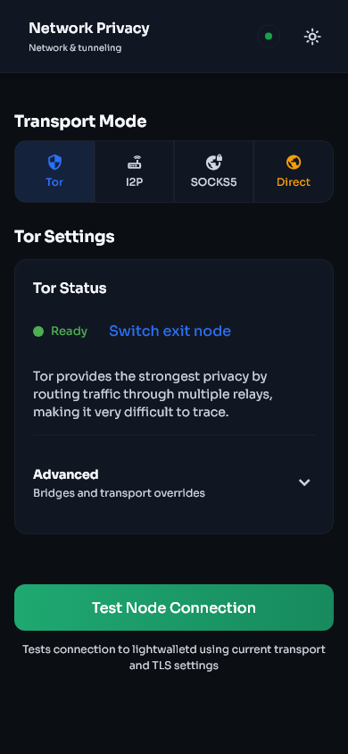
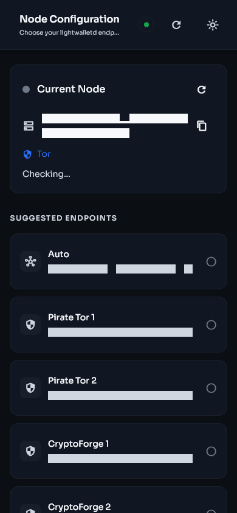

# Network privacy and synchronization

[Previous: Migration](migration.md) | [Guide contents](README.md) | [Next: Security and backups](security-and-backups.md)

Open **Settings > Privacy and Network > Transport** to choose how Stashi Wallet reaches its light server.

| Phone | Desktop |
|---|---|
|  |  |

## Transport choices

### Direct

Direct mode connects without an anonymity network. It is usually the simplest and fastest option, but the network path can reveal to your internet provider that the device is connecting to wallet infrastructure. Direct mode uses the device's configured DNS resolver.

### Tor

Tor routes the light-server connection through the Tor network. It improves network-level privacy but can be slower and may take time to establish a circuit. The wallet prefers the listed Tor endpoints and can also reach compatible clearnet endpoints through Tor when needed.

Changing a Tor exit path does not change wallet keys or addresses.

### SOCKS5

SOCKS5 sends the connection through a proxy you provide. Enter a host and port that you control or trust. A proxy can observe connection metadata and is not automatically private merely because it uses SOCKS5.

### I2P

I2P uses an available I2P route and compatible endpoint. It requires working I2P connectivity on the device or through the wallet's supported setup. Initial connection can take longer than direct mode.

## Node selection

Open **Settings > Privacy and Network > Node**.

- **Auto** uses the wallet's endpoint pool and failover checks.
- **Manual** stays with the server you select until you change it or return to Auto.

Auto mode checks more than whether a TCP connection opens. A usable endpoint must also report and serve suitable blockchain data. If one server is reachable but stalled or behind, the wallet can rotate to another endpoint.

Use manual mode for testing or when you operate a trusted server. Return to Auto if the selected server stops advancing.

| Phone | Desktop |
|---|---|
|  |  |

## What the sync stages mean

- **Preparing sync**: opening the wallet database, checking state, selecting an endpoint, and preparing cached or remote block data.
- **Downloading**: obtaining compact blockchain data that is not already cached.
- **Scanning**: testing compact outputs against the wallet's Sapling and Ironwood keys and updating wallet state.
- **Finalizing**: saving the last results and refreshing balances and Activity.
- **Synced**: the wallet has processed the reported chain tip.

The height shown by the wallet should continue to move when the chain advances. A connected label without block progress is not enough to confirm a healthy server.

## Cached blocks and rescans

Stashi Wallet keeps validated compact blocks locally so a rescan can avoid downloading the same range again. Cached data is checked before reuse. Adding a seed account or imported key triggers the required historical replay so the new key is tested against the relevant blocks.

Cached scanning still performs wallet trial decryption. It is not a shortcut that simply counts downloaded blocks.

## If Preparing sync does not finish

1. Leave the wallet open for several minutes after an update or large migration.
2. Confirm the device has working internet access.
3. In Auto node mode, wait for endpoint health checks and failover.
4. Try a different transport. For diagnosis, Direct can show whether Tor, I2P, or a proxy is the problem.
5. Choose another light server manually, then return to Auto after testing.
6. Restart the app once.
7. Check free disk space and system time.
8. Enable debug logging and reproduce the stall.

Do not repeatedly start rescans while another scan is active.

## Rescan the wallet

Use a rescan when the wallet has the right keys but its local transaction state is incomplete.

1. Open **Settings > Advanced > Rescan blockchain**.
2. Choose a height before the earliest missing transaction.
3. Confirm the rescan.
4. Keep the wallet open and let it finish.
5. Check Activity and the confirmed balance.

An earlier start height takes longer but cannot miss a later transaction because of the chosen birthday. A rescan cannot find funds belonging to a different phrase, a missing seed account, or a private key that was never imported.
