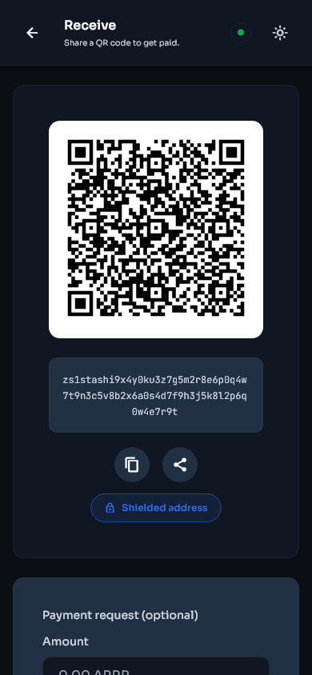
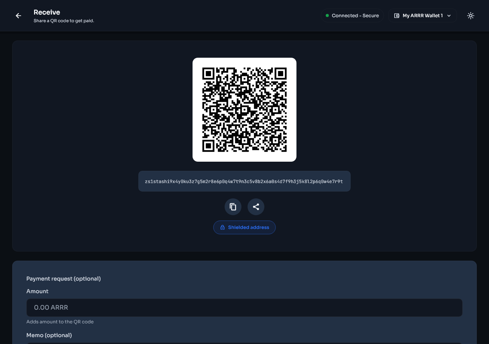
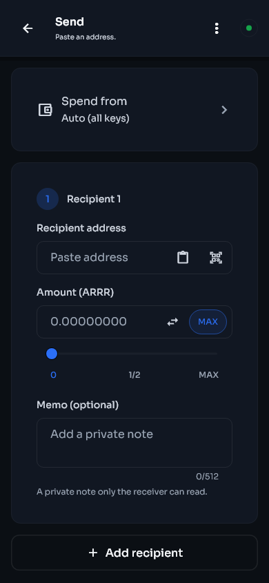
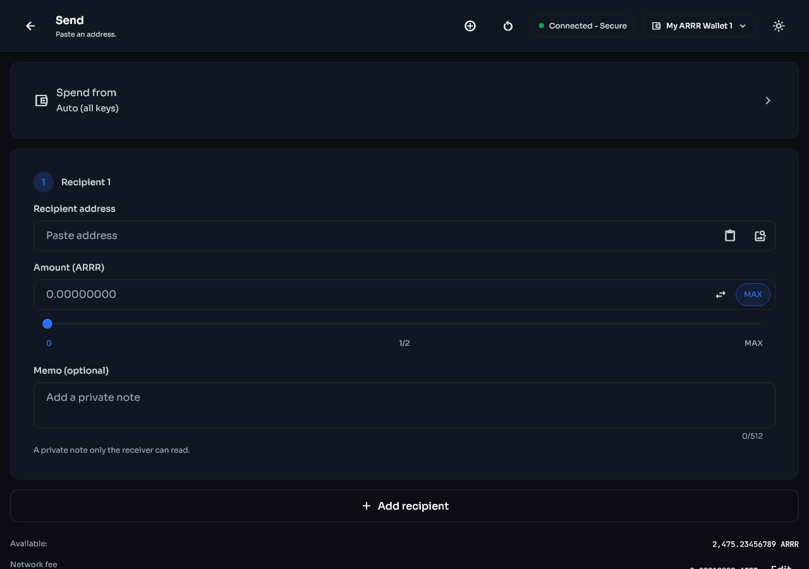

# Receive and send ARRR

[Previous: Wallet basics](wallet-basics.md) | [Guide contents](README.md) | [Next: Keys and accounts](keys-and-accounts.md)

## Receive ARRR

1. Open **Receive** from Home or Actions.
2. Confirm the wallet and key shown on the page.
3. Generate or select the address you want to use.
4. Add a local label if it will help you recognize the payment later.
5. Copy the address or let the sender scan the QR code.
6. Compare the beginning and end of the copied address with the address on screen.
7. Give the sender only the payment address or payment QR code.
8. Wait for the transaction to appear in Activity and receive confirmations.

| Phone | Desktop |
|---|---|
|  |  |

The operating system may hide sensitive text in screenshots or screen sharing. Use the in-app copy button when you need the full address.

### Address rotation

Stashi Wallet can generate diversified addresses for supported keys. A new address helps prevent different payments from being linked by the address alone. Previously generated addresses remain valid.

Address labels and color tags are local organization tools. They are not written to the blockchain and are not sent to the payer.

## Send ARRR

1. Open **Send**.
2. Paste the recipient address, scan a QR code, or import a QR image where supported.
3. Confirm that the address is a Pirate Chain address from the intended recipient.
4. Enter the amount.
5. Add a memo only if the recipient expects one. Treat memos as data that may be visible to the recipient and to anyone who later gains the relevant viewing authority.
6. Review the source selector. **Auto (all keys)** lets the wallet choose spendable notes across eligible keys. Select a specific key only when you need to control the source.
7. Review the network fee and total.
8. Continue to the confirmation screen.
9. Check the address, amount, memo, fee, and source one final time.
10. Approve the transaction with the requested passphrase or biometric check.
11. Keep the transaction ID until the recipient confirms receipt.

| Phone | Desktop |
|---|---|
|  |  |

Blockchain transactions cannot be cancelled after broadcast. Send a small test payment first when using a new address or moving a large balance.

## Source selection and available funds

The total wallet balance can be larger than the amount available to one selected key. If a specific source reports insufficient funds, choose **Auto (all keys)** or select a source with enough confirmed spendable notes.

Pending funds, immature funds, and notes currently reserved by another transaction are not immediately spendable. The review screen includes the fee in the required total.

## Multiple recipients

Where the Send page offers additional recipients:

1. Add one row per recipient.
2. Verify every address and amount separately.
3. Check that the displayed total includes all outputs and the fee.
4. Remove empty or accidental rows before confirming.

## Auto consolidation

Many small notes can make transaction construction slower or exceed transaction limits. Auto consolidation can combine suitable notes during sends. It never changes wallet ownership, but it creates normal on-chain transactions and fees may apply. Review this setting under **Settings > Wallet > Auto consolidation**.

## Sweep a spending key

Sweeping moves the spendable balance controlled by a selected spending key to an address you choose. Use it when retiring a key or consolidating custody.

1. Open **Settings > Keys & addresses**.
2. Open the spending key.
3. Select the sweep action.
4. Choose all addresses or the specific source offered by the screen.
5. Enter and verify the destination.
6. Review the full amount and fee before approving.

Do not sweep to an address unless you have confirmed that its recovery material is backed up.
