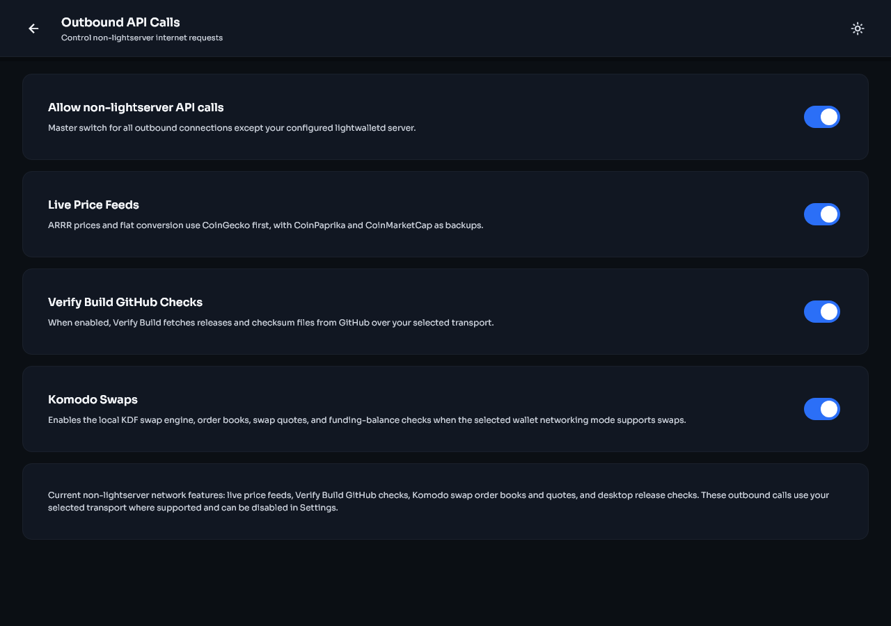

# Settings and build verification

[Previous: Security and backups](security-and-backups.md) | [Guide contents](README.md) | [Next: Troubleshooting](troubleshooting.md)

## Settings map

| Section | What it controls |
|---|---|
| Security | Biometrics, app passphrase, and duress passphrase |
| Privacy and Network | Light-server node, Direct, Tor, SOCKS5, I2P, and non-lightserver API access |
| Backups | Recovery phrase display and confirmation |
| Wallet | Keys, seed accounts, addresses, and auto consolidation |
| Trading | Swap interface preference when swaps are enabled |
| Appearance | Theme, fiat currency, app language, and recovery phrase language |
| Advanced | Birthday height, blockchain rescan, debug logging, and diagnostics |
| About | Version, Verify Build, terms, privacy information, and open source licenses |

| Phone | Desktop |
|---|---|
|  |  |

## Outbound API Calls

The light-server connection is required for wallet synchronization. Other internet features can be controlled separately under **Settings > Privacy and Network > Outbound API Calls**.

- **Live Price Feeds** controls ARRR price and fiat conversion requests. The wallet uses CoinGecko first, with CoinPaprika and CoinMarketCap as backups.
- **Verify Build GitHub Checks** allows the app to download signed release metadata from GitHub.
- **Komodo Swaps** allows order-book, quote, and funding-balance requests when swaps are supported.
- **Desktop Update Checks** allows desktop builds to check GitHub for new releases.

The master switch disables all of these non-lightserver requests. Turning off price feeds can leave the fiat estimate blank without affecting ARRR funds.

| Phone | Desktop |
|---|---|
|  |  |

## Currency, language, and theme

- Currency changes the estimated fiat display only. It does not convert or move ARRR.
- App language changes menus and messages.
- Seed phrase language tells the wallet how recovery words should be interpreted. Do not change it casually on an existing backup.
- Theme changes appearance only.

## Birthday height

The birthday is the earliest block the wallet needs to inspect. Set it before the first expected transaction.

1. Open **Settings > Advanced > Birthday height**.
2. Choose an approximate date or enter an exact height.
3. Save the value.
4. Start the offered rescan if you are trying to recover earlier history.

| Phone | Desktop |
|---|---|
|  |  |

Moving the birthday earlier increases scan work. Moving it later can exclude old transactions from a future rebuild.

## Verify My Build

Open **Settings > About > Verify build**, then select **Verify now**. The app downloads the signed release manifest for its exact version, verifies the PGP signature against the pinned Stashi Wallet release-key identity, hashes the local packaged artifact or installed executable, and compares it with the signed checksum.

| Phone | Desktop |
|---|---|
|  |  |

### Result meanings

- **Match**: the PGP-signed official manifest was valid and the local hash matched its entry.
- **Check unavailable**: the wallet could not complete the online check. This is not a failed integrity result. Check the selected transport and outbound GitHub permission, then try again.
- **Mismatch**: the local bytes did not match the signed manifest. Stop using that installation for sensitive work and download a fresh copy from the official release page.
- **Unsupported package**: the current platform or package format does not expose a local artifact that the in-app verifier can hash. Use manual release verification.

An unavailable network check is shown differently from a cryptographic mismatch.


The screenshots use sample release data to show the possible states. Your version, filename, hash, target, and build date will differ.

## Verify the downloaded release files

Each official release provides a signature bundle for its tag. The bundle contains the Stashi Wallet public key, a checksum manifest, a signature for that manifest, and detached signatures for release files.

The authoritative primary key fingerprint is:

```text
E4FB 2399 AECC F9B9 447D ED47 2CE6 5343 4015 53A6
```

The existing user ID on that key is:

```text
Pirate Unified Wallet <dev@piratechainfoundation.com>
```

The older user ID text remains attached to the same established Stashi Wallet release key. Confirm the complete fingerprint through an independent official Pirate Network channel. Do not trust a key only because it was downloaded beside the file it signs.

Typical GnuPG steps are:

```bash
gpg --import public_key.asc
gpg --fingerprint E4FB2399AECCF9B9447DED472CE65343401553A6
gpg --verify sha256sum-vX.Y.Z.txt.sig sha256sum-vX.Y.Z.txt
gpg --verify Stashi-Wallet-linux-x86_64.AppImage.sig Stashi-Wallet-linux-x86_64.AppImage
```

Use the filenames from the release you downloaded. PGP verification does not decrypt the application. It proves that the matching private key signed those exact bytes.

For the full command reference, see [Verify Builds](../verify-build.md).

## Debug logging

Debug logging is off by default.

1. Open **Settings > Advanced > Debug logging**.
2. Read the warning and enable it.
3. Reproduce the problem once.
4. Return to Debug logging and use the share or save action.
5. Turn logging off when finished. Disabling it clears the active debug log where the screen states that it will.

The logger is designed to redact known secrets, but inspect a log before sharing it. Never send a log that contains recovery words, a private key, an app passphrase, or personal information you do not want disclosed.
