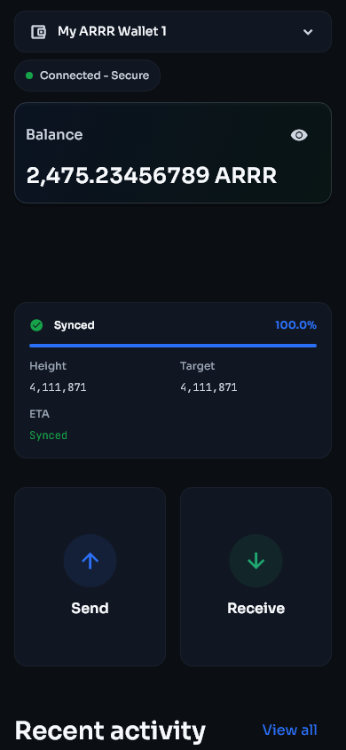
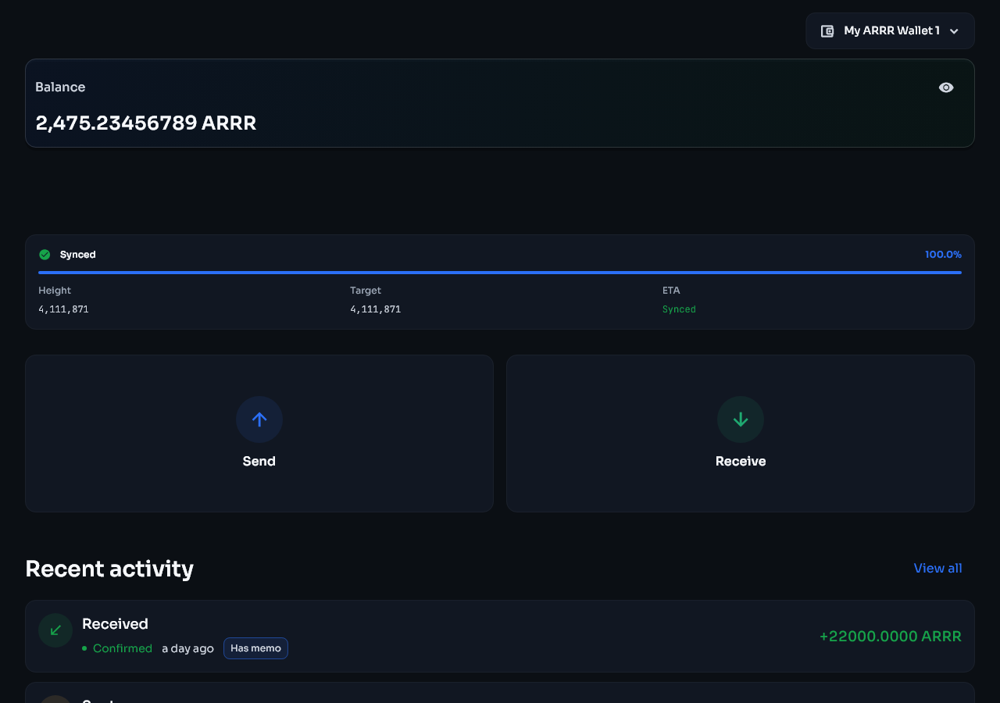
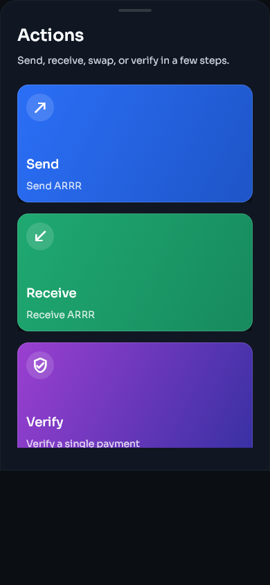
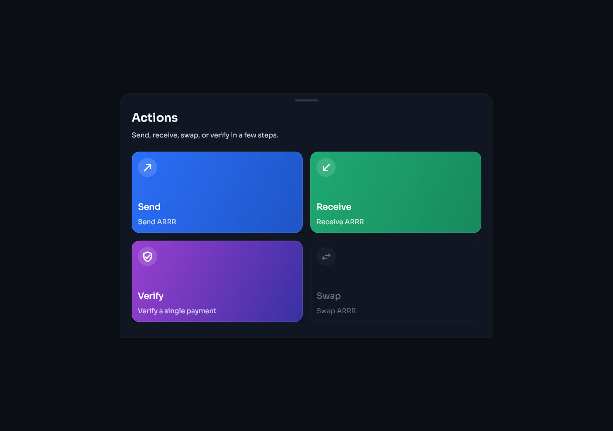
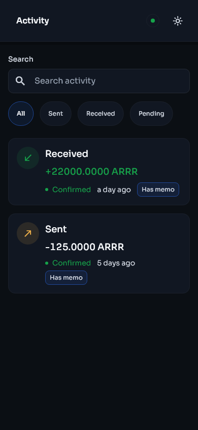
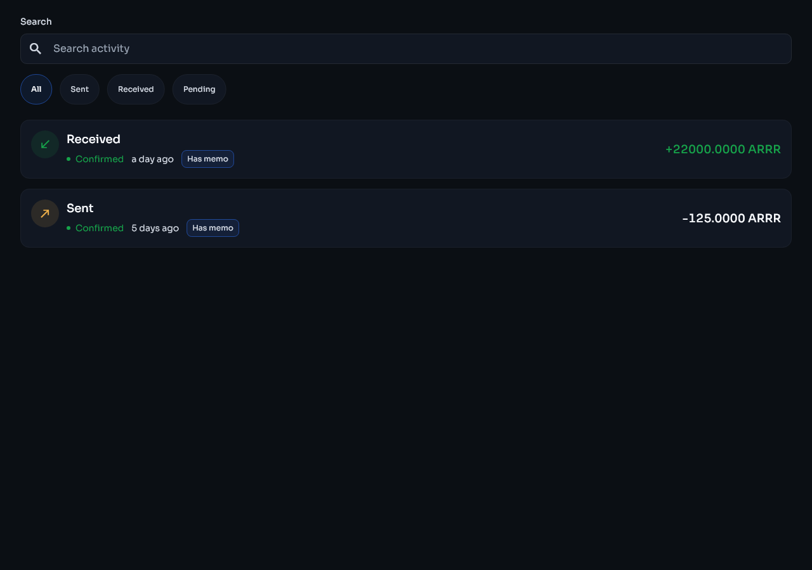
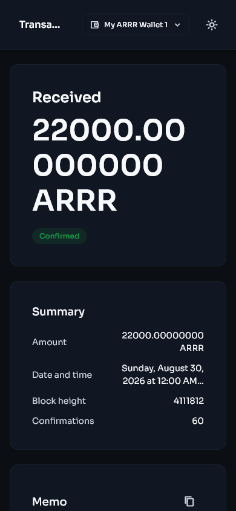

# Wallet basics

[Previous: Getting started](getting-started.md) | [Guide contents](README.md) | [Next: Send and receive](send-receive.md)

## Home

The Home page shows the selected wallet, connection state, balance, fiat estimate, sync progress, and shortcuts for common actions.

| Phone | Desktop |
|---|---|
|  |  |

### Wallet selector

Use the wallet name at the top of the page to switch between wallets. Always check this before copying an address, importing a key, or sending funds.

### Connection status

The status chip reports whether the wallet is connected and which privacy transport is active. A connection alone does not mean scanning has finished. Check the sync card as well.

### Balance card

- The main figure is the wallet's ARRR balance.
- Use the eye control to hide or show values.
- The smaller figure is an estimated fiat value in the currency selected under Settings.
- Fiat prices come from an external price service and can be temporarily unavailable. This does not affect the ARRR balance.

### Sync card

The sync card shows the current stage, block height, progress, and estimated time when available. Common stages are preparing, downloading, scanning, and synced. Keep the app open if the operating system restricts background activity.

## Actions

The Actions page groups send, receive, swap, and payment verification tools.

| Phone | Desktop |
|---|---|
|  |  |

On a small screen, scroll to see all actions. Depending on the build and wallet mode, this page can include send, receive, sweep, swap, and payment disclosure tools.

## Activity

Activity lists detected wallet transactions. Open an entry to see its direction, status, amount, fee, memo, addresses where available, block information, and transaction ID.

| Phone | Desktop |
|---|---|
|  |  |

| Transaction details on a phone | Transaction details on desktop |
|---|---|
|  |  |

New transactions can appear before final confirmation. Do not treat an unconfirmed incoming payment as final. If an expected transaction is absent, wait for a full sync and follow [Missing balance or transaction](troubleshooting.md#missing-balance-or-transaction).

## Settings

Settings contains security, network, backup, key, appearance, sync, diagnostics, and build-verification controls.

| Phone | Desktop |
|---|---|
|  |  |

## Navigation on different screen sizes

- Phone: use the navigation bar at the bottom. Scroll long pages vertically.
- Desktop and tablet: navigation may use more horizontal space, and related cards may appear in columns.
- Keyboard: use Tab and Shift+Tab to move between controls, Enter or Space to activate them, and Escape to close a dialog where supported.
- Screen reader: buttons, status controls, and important values have accessibility labels. Keep the operating system screen reader enabled while learning a page.
